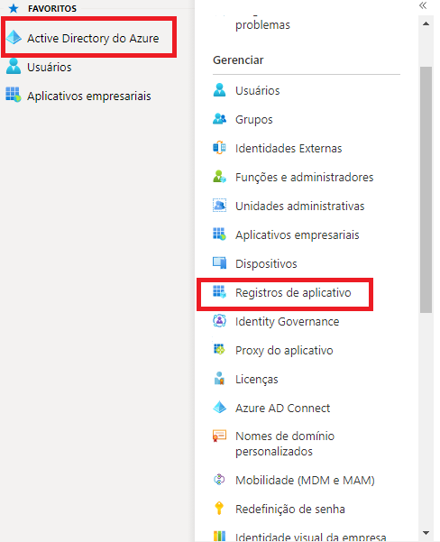
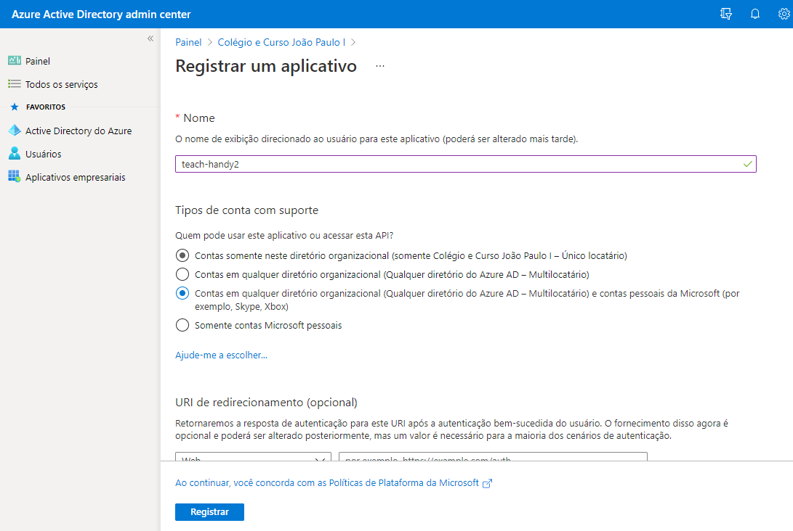
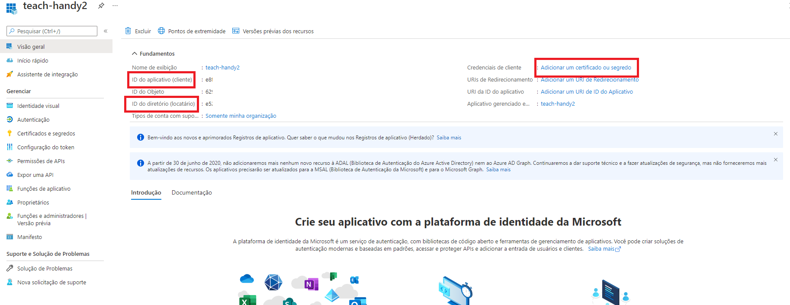

# TeachHandy
A Daemon app that uses MongoDB and Microsoft Graph to automate creation and management of students accounts on Azure Active Directory

Um aplicativo do tipo daemon que utiliza o MongoDB e Microsoft Graph para automatizar a criação e gerenciamento de estudantes no Azure Active Directory de uma escola.

## Obter credenciais do Azure
- Realize o login no Azure Active Directory da sua organização, vamos obter as informações para preencher os campos <mark>TENANT_ID</mark>, <mark>CLIENT_ID</mark> e <mark>CLIENT_SECRET</mark> do arquivo <mark>.ENV</mark>. A estrutura completa pode ser obtida no arquivo <mark>.ENV.EXAMPLE</mark>

- Clique no menu lateral para o início Azure Active Directory, em seguida selecione a opção chamada "Registros de Aplicativo".

- Selecione a opção de novo registro
- Escolha o nome de exibição e as os tipos de conta com suporte, a URI de redirecionamento pode deixar em branco. Clique em registrar.

* Assim que o aplicativo estiver criado, exibirá o menu do aplicativo, onde já é possível obter o <mark>TENANT_ID</mark> e <mark>CLIENT_ID</mark>, nos campos de ID do diretório e ID do aplicativo respectivamente. Clique na opção "Adicionar um certificado ou segredo" localizada no lado direito da página.

* Procure a opção "Novo segredo do cliente" na parte inferior da página. 
* Insira a descrição e o período de expiração do token.
* Após a criação, haverá uma coluna com o cabeçalho "ID Secreto", apenas copiar o valor e já possuímos o <mark>CLIENT_SECRET</mark> da aplicação.

* O próximo passo é autorizar esse aplicativo que criamos no Azure a gerenciar os recursos do diretório da sua organização. De volta ao menu da imagem 3, procure o botão "Permissões de APIs", selecione a opção "Adicionar Permissões" > escolha "Microsoft Graph" > em seguida "Permissões de aplicativo".
* Marque as seguintes opções: 
<mark>EduRoaster</mark>,
<mark>EduAssignments</mark>,
<mark>EduAdministration</mark>,
<mark>Directory</mark>,
<mark>Organization</mark>,
<mark>Teams</mark>,
<mark>User</mark>,
* Marque o botão "Adicionar permissões".